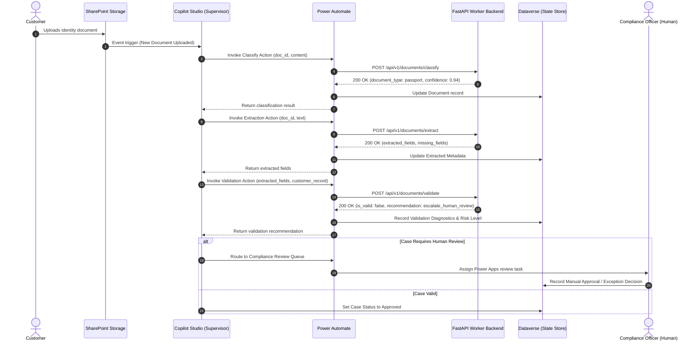

# Multi-Agent KYC Onboarding Automation — Architecture

## 1. Executive Summary

Financial-services Know Your Customer (KYC) onboarding processes traditionally suffer from rigid pipelines, error-prone manual reviews, and prolonged turnaround times. This project implements a **Multi-Agent Orchestrated KYC Architecture** that decouples dynamic, non-linear case reasoning from bounded, deterministic worker tools.

```
┌─────────────────────────────────────────────────────────────────────────────┐
│                    Microsoft Copilot Studio (Supervisor Agent)               │
│         [Reasoning Engine, Dynamic Goal Planning, Action Selection]          │
└──────────────────────────────────────┬──────────────────────────────────────┘
                                       │
                Trigger Action / Tool  │  Structured Result
                                       ▼
┌─────────────────────────────────────────────────────────────────────────────┐
│                            Power Automate Flows                             │
│       [HTTP Actions, SharePoint Connectors, Dataverse State Sync]            │
└──────────────────────┬───────────────────────────────┬──────────────────────┘
                       │                               │
       HTTP REST API   │               Dataverse Sync  │
                       ▼                               ▼
┌──────────────────────────────────────┐  ┌───────────────────────────────────┐
│     FastAPI Worker Services          │  │        Microsoft Dataverse        │
│                                      │  │                                   │
│ • Document Classification Service    │  │ • KYC Cases Table                 │
│ • Field Extraction Service           │  │ • Customer CRM Records            │
│ • Deterministic Validation Service   │  │ • Uploaded Documents Metadata     │
│ • Case Discrepancy Analyzer          │  │ • Immutable Audit Logs            │
└──────────────────────────────────────┘  └───────────────────────────────────┘
```

---

## 2. Component Responsibilities

### A. Supervisor Agent (Microsoft Copilot Studio)
- **Role**: Case strategist and planner.
- **Dynamic Reasoning**: Evaluates current case state from Dataverse and decides which tool to invoke next based on dynamic logic:
  - If a document is unclassified $\rightarrow$ invoke `classify_document`.
  - If document type is known but fields are missing $\rightarrow$ invoke `extract_document_fields`.
  - If fields are extracted $\rightarrow$ invoke `validate_fields`.
  - If validation returns `needs_information` $\rightarrow$ trigger customer clarification email.
  - If validation returns `escalate_human_review` $\rightarrow$ route case to Human-in-the-Loop review queue.
  - If all rules and required documents pass $\rightarrow$ mark KYC case as complete.

### B. Worker Services (Python FastAPI Backend)
- **Role**: Stateless, deterministic execution units.
- **Characteristics**:
  - Bounded responsibility (each service executes exactly one specialized task).
  - Deterministic evaluation (uses verifiable business rules and strict date/format math).
  - Structured JSON response contracts designed for consumption by Power Automate.
  - No legal authorization authority (outputs diagnostics and recommendations, never final legal approvals).

### C. Power Platform Integration Layer
- **Role**: Data persistence, file management, human escalation, and governance.
- **Power Automate**: Acts as the API gateway between Copilot Studio and the FastAPI worker endpoints.
- **Dataverse**: The authoritative single source of truth for case states, customer master records, and audit events.
- **SharePoint**: Secure document repository storing raw PDF/image files.

---

## 3. Dynamic Multi-Agent Workflow vs. Fixed Pipeline

| Dimension | Traditional Fixed Pipeline | Multi-Agent Supervisor Architecture |
| :--- | :--- | :--- |
| **Execution Path** | Hardcoded: Step 1 $\rightarrow$ Step 2 $\rightarrow$ Step 3 $\rightarrow$ Step 4 | Non-linear: Agent selects next action based on current state |
| **Exception Handling** | Breaks or aborts entire batch on unexpected format | Agent adapts, requests targeted clarifications, or routes to human reviewer |
| **Partial Data Handling** | Requires complete re-upload | Agent identifies specifically missing fields and retains verified data |
| **Separation of Concerns** | Monolithic code coupling logic with data storage | Clear boundary: Reasoning (Copilot Studio) vs Workers (FastAPI) vs State (Dataverse) |

---

## 4. Communication & Data Flow



---

## 5. Security and Governance

1. **Synthetic Data Only**: The backend repository utilizes synthetic datasets for all testing and demonstration.
2. **Stateless Processing**: The FastAPI backend does not persist document contents to local disks.
3. **PII Masking**: Logging utilities automatically redact document identifiers, account numbers, and social identifiers.
4. **Header Authentication**: Supports configurable `X-API-Key` headers for securing Power Automate HTTP actions.
